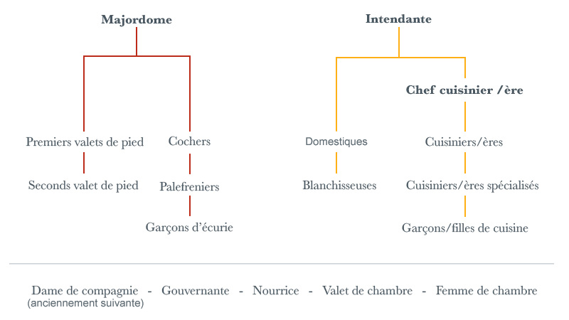

# 👑 La Noblesse


Par Akhilane.


## #1 • Un listing des titres dans l’ordre « hiérarchique »

* **Empereur** / **Impératrice** ou **Roi** / **Reine**


la mère du **Roi** ou de l’**Empereur** est la Reine/Impératrice _**Douairière.**_ De même, si le monarque est un homme, son conjoint est le _**« consort »**_ (« reine/impératrice » si c’est une femme, « prince », si c’est un homme.


* **Prince royal** / **Princesse royale** ou (**Archiduc** / **Archiduchesse** = qui est l’équivalent puisque c’est généralement le titre des enfants de l’Empereur)\
  \=> Parmi eux, vous avez le **Prince héritier** ou "_**Dauphin**_" dans la royauté française ("_Crown Prince_" en anglais) qui est le successeur en titre du trône.
* **Prince** / **Princesse** (autre que les enfants directs du roi en place : on les appelle en général les « Princes de Sang » et c’est une spécificité française. En Grande-Bretagne, les princes « de sang » n’existent pas : il sont élevés au rang de Duc à leur mariage)
* **Duc** / **Duchesse**
* **Marquis** / **Marquise**
* **Comte** / **Comtesse** (le titre le plus ancien, qui date de l’antiquité)
* **Vicomte** / **Vicomtesse**
* **Baron** / **Baronne**
* **Baronnet**
* **Chevalier**
* **Ecuyer**


Parfois, il peut arriver que les termes de « pair » ou « pairie » apparaissent (c’est le « _level-up_ » d’un titre qui est généralement attaché à la possession d’une terre/domaine et qui concerne essentiellement le Duché ou le Comté, même s’il y a des exceptions) : ils ont quelques privilèges supplémentaires.


## #2 • En ce qui concerne les domaines

* Empereur => _**Empire**_
* Roi => _**Royaume**_
* Duc => _**Duché**_
* Marquis => _**Marquisat**_
* Comte => _**Comté**_
* Vicomte => _**Vicomté**_
* Baron => _**Baronnie**_

## #3 • **Comment parle-t-on dans la noblesse ?**

Lors d'un dialogue impliquant la noblesse, il ne faut pas oublier que le vouvoiement est de mise !\
De plus, il y a un formalisme (décrit ci-dessous) qui est à respecter.

1. Empereur / Impératrice ou Roi/Reine = Votre Majesté (si on parle d’eux à la troisième personne « Sa Majesté »)
2. Prince royal / Princesse royale ou Archiduc / Archiduchesse = Votre Altesse impériale/royale (selon si c’est l’enfant d’un empereur ou d’un roi)
3. Prince = Votre Altesse
4. Duc / Duchesse = Votre Grâce / Monsieur le Duc / Madame la Duchesse
5. Marquis / Marquise = Lord / Lady ou Monseigneur ou Messire / Madame (au pire, directement son titre)
6. Comte / Comtesse = Lord / Lady ou Monseigneur ou Messire / Madame (au pire, directement son titre)
7. Vicomte / Vicomtesse = Lord / Lady ou Monseigneur ou Messire / Madame (au pire, directement son titre)
8. Baron / Baronne = Lord / Lady ou Monseigneur ou Messire / Madame (au pire, directement son titre)
9. Baronnet = Sir / Lady ou Monseigneur ou Messire / Madame (au pire, directement son titre)
10. Chevalier = Sir / Lady ou Messire / Madame (au pire, directement son titre)
11. Ecuyer = Sir / Lady ou Messire / Madame (au pire, directement son titre)


Et pour les enfants de nobles ?


* Les aînés => Lord / Lady (si vous gardez le terme anglais) ou Monsieur / Mademoiselle
* Les cadets => « Honorable + nom + prénom » (si vous gardez le terme anglais) ou Monsieur / Mademoiselle


Si vous tombez sur une oeuvre avec des ecclésiastiques (prêtres, évêques etc), il y a également une règle précise à suivre !


* Pape => Votre Sainteté
* Cardinal => Eminence / Votre Eminence
* Archevêque => Excellence / Votre Excellence
* Évêque => Monseigneur

## #4 • Les domestiques&#x20;


Merci à Rousse pour sa contribution.


<figure><figcaption>
diagramme représentant les différents postes dans un château.
</figcaption></figure>


